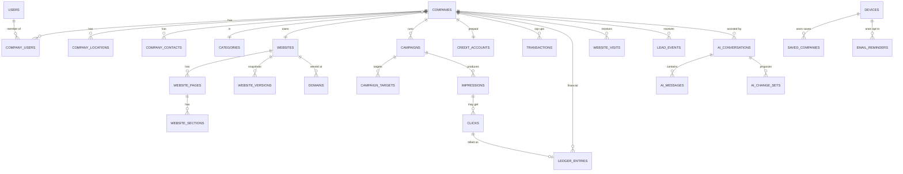

# Totalvizibil — Product Requirements Document

> **Status:** Draft v1 · **Owner:** Product · **Date:** 2026-08-29
> **Scope:** Full platform PRD. Supersedes nothing; consolidates and extends the notes in
> `01-VISION` … `05-DECISIONS`, `architecture/*`, `ai/*`, `business/*`, `product/*`.
> Where this document disagrees with an earlier note, this document wins and the change is
> called out in **§27 — Changes to the Original Concept**.

---

## 0. One-paragraph summary

Totalvizibil is a **local-commerce discovery network**. Any business describes itself once,
in plain language, and an AI assistant produces a complete, responsive website plus a
structured directory profile. Those profiles populate a public **marketplace feed** that
end users browse with **no account required**. Businesses can optionally load prepaid
**credit** and pay **per click (CPC)** to accelerate their exposure inside that feed. A
**quality- and fairness-weighted ranking engine** decides ordering so that budget alone
never buys the whole first page. The AI assistant stays in the loop after launch to edit
the site, explain analytics, and tune campaigns. The website builder is the wedge that
removes the "getting online" barrier; the CPC marketplace is the revenue engine; owning
the demand side (our own feed + SEO) is what makes the CPC economics work.

---

## 1. Product Vision

**From the original vision (kept):** local business owners are experts at their trade, not
at technology — websites, SEO, ads, analytics and "software" are barriers. Customers have
the opposite problem: they know what they need but not how to find the right local
provider. The platform hides technical complexity behind a conversational interface and
connects business supply with customer demand.

**Extended vision:** become the default place a small or mid-sized local business creates
and maintains its online identity, and the default place a nearby customer looks for a
trusted local provider — starting in one metro, designed from day one to run in multiple
cities, currencies and languages (RO / EN / DE already scaffolded in the frontend).

**North-star:** *number of businesses that receive a real customer contact (call, message,
lead, or directions) through the platform in a rolling 30-day window.* It captures both
sides of the marketplace and both halves of the product (site + discovery).

**Non-goals:** a general-purpose website CMS; a horizontal ads network; a review site;
a booking/payments-between-user-and-business product (possible much later, explicitly out
for the foreseeable roadmap).

---

## 2. Value Proposition

| Audience | Today's pain | What Totalvizibil gives them | Why it's defensible |
|---|---|---|---|
| **Business owner** | No site, or an abandoned one; ads are intimidating and opaque; agencies are expensive | A real website in minutes from a conversation; a free organic listing; pay only to go faster; one dashboard, plain-language AI help | The AI removes the setup barrier entirely; free listing lowers acquisition cost to near-zero |
| **End customer** | Search engines mix ads, SEO spam and irrelevant national chains; hard to judge a local provider | A clean local feed, transparent "sponsored" labelling, fast mobile company pages, one tap to call/message | Curated local supply + transparency that Google/Yelp don't offer |
| **Platform (us)** | — | Owned, high-intent ad inventory; recurring CPC spend; expansion by city and category | We own demand (feed + SEO), so we're not arbitraging someone else's traffic |

**Core promise to businesses:** *"A professional presence with zero setup cost. You only
pay when a customer clicks to reach you — and never more than you've loaded."*

---

## 3. Target Users

### 3.1 Primary personas

1. **Solo / micro service business** (electrician, plumber, roofer, cleaner, hairdresser).
   0–3 employees, phone-first, no website or a dead one. Wants calls, not a "digital
   strategy". Price-sensitive; will spend €20–€150/mo if it visibly produces calls.
2. **Small established business** (restaurant, dental clinic, driving school, workshop).
   3–25 employees, has *some* online presence, frustrated with juggling it. Wants leads
   and to look credible. Will spend €100–€800/mo.
3. **End customer** (no account). On a phone, has an immediate or near-term need, local
   intent, comparing 2–5 options quickly.

### 3.2 Secondary / internal

4. **Platform admin** — taxonomy, verification, ranking configuration, finance
   reconciliation.
5. **Support / moderation** — onboarding review, reports, fraud queue.
6. **Finance** — reconciliation, refunds, invoices, tax.
7. **Agency / power user** (future) — manages several company accounts.

---

## 4. Core User Journeys

### 4.1 Business: zero → live

```
Discover (SEO page / referral / ad)
  → AI interview: 5–8 plain questions (what you do, where, services, hours, contact, tone)
  → AI generates a one-page site + directory profile + SEO + FAQ  (preview, no account yet)
  → Refine by chat ("make it more premium", "add a renovations page")
  → Create account / claim the profile  (email + password or Google)
  → Publish  → FREE: live website at slug.totalvizibil.tld + organic feed listing
  → (optional) Add credit → set category + service area + max CPC → activate campaign
  → Receives calls / messages / leads
  → Dashboard shows impressions, clicks, spend, leads; AI explains and suggests
  → Tops up credit
```

Time-to-first-value target: **< 10 minutes** from landing to a shareable published site.

### 4.2 End customer: need → contact (no account)

```
Land (SEO landing "Electricians in Heidelberg" / direct / reminder email)
  → Search or pick category + city   ("electrician Heidelberg", "restaurants Stuttgart")
  → Feed: mostly organic results + at most 1–2 clearly-labelled Sponsored + occasional
     "new business" slot
  → Open a company card → see photos, services, hours, reviews (later), map
  → Tap: Call · WhatsApp · Visit website · Send a short lead
  → (optional) Save the company  (anonymous, device-local)
  → (optional) "Email me a reminder"  → enters email → double opt-in
```

No login wall ever appears in this path.

### 4.3 Admin: keep the ecosystem healthy

```
Onboarding review queue (AI pre-screens) → approve / request changes / reject
Taxonomy: categories, subcategories, locations, tags
Ranking console: weights, sponsored-slot ratio, exploration rate, new-business boost,
  min bid, category price ceiling, quality floor  (versioned, audited)
Fraud queue: flagged clicks / advertisers / sources → not-bill / reverse / blocklist / suspend
Moderation: reports, AI content flags, duplicate/fake-business detection
Finance: ledger vs Stripe reconciliation, refunds, invoices, adjustments
Companies: verify, suspend, edit, adjust credit (audited)
```

### 4.4 AI assistant (cross-journey)

Onboarding interviewer · website editor ("change primary colour", "rewrite in a
professional tone", "add a Services page") · analytics explainer ("why many views, few
clicks?") · campaign advisor ("how do I get more clicks?" → headline / image / CTA / CPC /
category suggestions). The assistant **proposes**; deterministic code **applies** (see §11).

---

## 5. Business Model

- **Free tier (acquisition wedge):** AI-generated website + hosting on a platform
  subdomain + an organic directory listing. No setup fee (consistent with `05-DECISIONS`
  DEC / "no setup fee"). Cost to us per free business is bounded by the AI cost controls in
  §11.7 and §21.
- **Paid (revenue):** prepaid **credit** consumed by **CPC** on sponsored feed placements.
  No subscription required to advertise.
- **Secondary revenue (later):** custom domain, advanced analytics, extra AI credit packs,
  verified/featured profile subscription, template marketplace rev-share, CPL billing.
  Full treatment in **§26 — Monetization Strategy**.
- **Financial discipline (from `architecture/LEDGER`, `business/MONEY-FLOW`, `business/REFUNDS`):**
  prepaid credit is a **liability / deferred revenue**, never booked as profit on purchase.
  Revenue is recognised **only** when a valid billable click is charged. Cash, client
  credit, recognised revenue, payment fees, refunds payable, AI cost and traffic cost are
  tracked as **separate ledger accounts**. Every state change is a double-entry
  transaction. Unconsumed credit remains refundable per a legally-reviewed policy.

---

## 6. Marketplace Model

### 6.1 Structure

- **Entities:** Company → one or more Locations (with a service radius or area) → Category
  (+ subcategories) → Tags. A Company always has exactly one canonical directory profile;
  its website is a separate, richer surface.
- **Browse axes:** category, subcategory, location (country → region → city → district),
  free-text query, "open now" (later), tags/filters.
- **URLs (SEO-first):** `/{country}/{city}/{category}` and
  `/{country}/{city}/{category}/{company-slug}` — programmatically generated, canonical,
  indexable only above a quality threshold (see §21 SEO risk).
- **Placement types**, always visually distinguished (§18):
  - **Organic** — ranked by relevance × quality × popularity × freshness + diversity.
  - **Sponsored** — auction winners, capped at a small share of visible slots, labelled.
  - **Exploration / New** — reserved slots for under-measured or new companies.

### 6.2 Supply model — solving the cold start

1. **Seed supply before demand.** For each launch category in the launch metro,
   pre-build **200–500 "unclaimed" profiles** from public data (business registries, maps
   data where terms allow, public listings). AI drafts a basic profile + site; the real
   owner can **claim** it (verification in §21). This makes the feed useful on day one.
2. **Concierge onboarding** for the first cohort of advertisers (assisted setup, we watch
   for friction).
3. **Free forever organic listing** so there's no reason *not* to be listed.
4. **Programmatic local SEO** landing pages drive end-user demand into the same feed.

### 6.3 Demand model

- Organic search (the SEO landing network) → feed.
- Direct / word of mouth / business-shared links (a business promoting its own free site
  sends traffic back through the platform).
- Reminder emails (opt-in) → return visits.
- Paid acquisition (Google/Meta) — **a controlled growth lever, not the core engine**
  (change from original concept — see §27).

---

## 7. CPC Model

### 7.1 Rules

| Rule | Detail |
|---|---|
| Prepaid only | A campaign can serve a **sponsored** impression only if `credit_balance ≥ max_cpc`. Guarantees every possible click is fully fundable. |
| **No negative balance** | Hard invariant. When balance can no longer cover `max_cpc`, the campaign auto-pauses, the sponsored listing drops to its organic position, and an alert email is sent. No debt is ever accrued. |
| Pay per **valid** click | Only clicks that pass the fraud pipeline (§15) are billed. Invalid clicks are logged but never charged; clicks later found fraudulent are **reversed** (credit returned). |
| Billed price ≤ your max | See §8.4 pricing. Advertiser sets `max_cpc`; actual charge is usually lower. |
| Budgets | `max_cpc` (per click) always; `daily_budget` and `monthly_budget` optional (SHOULD, with pacing). |
| Targeting | category / subcategory + location (city or radius) required; keywords optional (Phase 2); schedule optional (Phase 2). |
| One active campaign per company for MVP | Multiple campaigns / ad groups is a later refinement. |

### 7.2 Credit lifecycle

```
Top-up (Stripe Checkout)
  → transaction row (gross, fee, net, currency, stripe refs)
  → ledger: company_credit +net ; platform_cash +gross ; stripe_fees −fee ; deferred_revenue +net
Valid billable click
  → ledger: company_credit −price ; recognised_revenue +price
Reversed click (fraud found later)
  → ledger: company_credit +price ; recognised_revenue −price
Refund of unconsumed credit
  → ledger: company_credit −amount ; platform_cash −amount ; (fees handled per policy)
```

`credit_accounts.balance_micros` is a **cached projection** of the `company_credit` ledger
account; a scheduled job asserts they match and alarms on drift.

### 7.3 What we deliberately do *not* do at MVP

Cost-per-lead / outcome billing (needs trustworthy lead verification — Phase 4), keyword
auctions, national/broad targeting, automated bidding.

---

## 8. Ranking Algorithm

### 8.1 Goals

Relevant results for the user · a fair shot for small and new businesses · protected
platform revenue · resistant to manipulation · fully **admin-tunable** and **explainable**
(both to users and to advertisers).

### 8.2 Candidate selection (per feed request)

`request = {category?, subcategory?, location, free_text?, filters, device_id, session_id}`

Candidates = companies where: category/subcategory matches (or strong text match) **and**
location is within the company's service area **and** `status = active` **and**
`quality_score ≥ quality_floor` **and** not blocklisted.

### 8.3 Per-candidate signals

| Signal | Range | Notes |
|---|---|---|
| `relevance` | 0–1 | BM25 over name/services/description (if free text) + category exactness + distance decay + parsed-intent match (urgency, service). If no free text: category match + distance decay. |
| `quality_score` | 0–1 | Admin-weighted composite of: website quality (completeness, Core Web Vitals, mobile, real images, content depth), profile completeness (hours, contact methods, photos), **position-debiased** historical CTR, outcome rate (leads+calls per click), responsiveness to leads *(Phase 2)*, rating *(Phase 2)*, freshness (last update / last active), minus complaint & report rate. |
| `popularity` | 0–1 | Smoothed, decayed engagement volume (visits, leads) — used for organic only. |
| `freshness` | 0–1 | Recency of meaningful updates / activity. |
| `effective_bid` | money | Sponsored candidates: `min(max_cpc, pacing_cap)`; organic candidates: `0`. |
| `boost` | ≥1 | New-business / exploration multiplier, decaying (see §9). |

### 8.4 Scoring & slotting

The feed has `N` visible positions. The layout **reserves**:

- `S_sponsored` sponsored slots — a small share (default ≤ 20% of visible, with a minimum
  gap between them), admin-configurable per category/location.
- `S_explore` exploration slots — default ~10–15% of impressions (§9).
- The remainder are **organic**.

**Sponsored ordering** (fill `S_sponsored`): eligible advertisers ranked by

```
ad_rank = effective_bid × quality_score × relevance^γ        (γ > 1, configurable)
```

subject to per-advertiser frequency capping within a session and budget pacing.

**Sponsored pricing — generalised second price:** the advertiser at rank *i* pays the
minimum that would have kept position *i*:

```
price_i = ( ad_rank_(i+1) / ( quality_i × relevance_i^γ ) ) + tick
price_i = clamp(price_i, min_bid, max_cpc_i)
```

Rationale: reduces overpayment, dampens bid-war escalation, makes spend predictable, and
removes the incentive to probe competitors' bids. (MVP may start with pay-your-bid and
switch to second price in Phase 2 — see §22.)

**Organic ordering** (fill remaining slots):

```
organic_score = relevance × ( w_q·quality_score + w_pop·popularity + w_fresh·freshness ) × boost
```

then apply **diversity constraints**: at most `k` listings per owning entity / franchise
in the visible set; ensure a spread of company sizes; then inject **exploration** picks
(§9) into `S_explore`.

**Explainability:** every returned listing carries a machine-readable `placement`
(`organic` / `sponsored` / `exploration`) and, for advertisers, a stored breakdown
(`relevance`, `quality_score`, `ad_rank`, `price`, competing `ad_rank_(i+1)`) surfaced in
their reporting (§18).

### 8.5 Why an auction, not a formula

The `Bid × Quality × Relevance × Fairness` sketch in `product/RANKING-ENGINE` is directionally
right but a single multiplicative score can't express *slot reservation*, *second-price
billing*, *diversity*, or *exploration* cleanly. Modelling it as **"reserve slots →
auction the sponsored ones → score the organic ones → inject exploration"** keeps each
concern independent, tunable and testable, and matches how mature marketplaces actually
work.

### 8.6 Admin-controlled parameters

`w_q, w_pop, w_fresh, γ`, sponsored slot count & ratio, exploration rate, boost magnitude
& decay, `min_bid`, category price-ceiling multiplier, `quality_floor`, diversity `k`,
distance-decay half-life — all versioned in `ranking_configs`, scoped global / per-category
/ per-location, with `effective_from` and full audit history.

---

## 9. Fairness System (small & new business exposure)

**Problem to defeat:** the biggest budget permanently owns page one, small/new businesses
are never seen, the feed stops being useful, and organic discovery (our SEO moat) decays.

**Mechanisms (layered):**

1. **Quality-gated auction.** Bid never stands alone: `ad_rank = bid × quality × relevanceᵞ`.
   A high bid on a weak listing loses to a modest bid on a strong one.
2. **Sponsored-slot cap.** Money can buy only a minority of *visible* slots. Most of page
   one is always organic.
3. **Exploration budget.** A fixed fraction of impressions (default 10–15%, admin-set) is
   allocated to **under-measured** candidates regardless of bid. MVP: ε-greedy over
   low-impression companies. Phase 2: **Thompson sampling** on Beta(CTR, no-CTR) so
   promising unknowns rise faster and confident losers fade.
4. **New-business boost.** For the first *T* days **or** first *K* impressions (whichever
   comes first), `quality_score` is multiplied by a decaying `boost > 1`. As real data
   accumulates, the boost decays to 1 and the listing converges to its earned score. This
   gives the algorithm the data it needs instead of cold-starting a company at zero.
5. **Score-band rotation & frequency capping.** Within a band of near-equal scores,
   positions rotate across requests/sessions; the same advertiser is not shown in the top
   slot for every query in a session.
6. **Diversity constraints.** Max `k` listings per owning entity; deliberate mix of
   company sizes in the visible set.
7. **Category price ceiling.** A soft cap (e.g. `3× median category bid`) stops a single
   advertiser from pricing an entire category out of reach.
8. **Organic floor.** Every eligible, above-quality-floor company is guaranteed to appear
   somewhere within the first *M* pages for its exact category + city. You can pay to rise;
   you cannot pay to bury a competitor entirely.

**Revenue is still protected** because exploration + boost consume a *bounded* slice of
inventory; the large majority of high-intent impressions still route through the auction,
where advertisers compete hard for a scarcer, better-labelled set of slots. Fairness
constrains *where* money wins, not *whether* it wins.

**Fairness is measured, not assumed** (see KPIs §24): small-business impression share,
Gini coefficient of impressions across active companies, new-business time-to-first-lead,
and the share of sessions containing ≥1 organic contact action.

---

## 10. AI Assistant Architecture

### 10.1 Principle (from `ai/AI-ARCHITECTURE`, `05-DECISIONS` DEC-008)

AI is an **interpretation and generation layer**, never the system of record. It produces
**typed proposals**; deterministic code validates and applies them. It has **no direct
write access** to the database, money, campaigns, or ranking.

### 10.2 Capabilities & contexts

| Context | AI does | AI cannot |
|---|---|---|
| **Onboarding interview** | Ask a short adaptive question set; extract structured business facts; draft profile + one-page site + SEO + FAQ | Publish; charge; verify identity |
| **Website editor** | Propose a **change-set** (patch to the page/section tree): rewrite copy, add/remove/reorder sections, add a page, adjust theme tokens, generate alt text / SEO | Write the DB directly; bypass the section schema or content policy |
| **Analytics explainer** | Read aggregated metrics; explain "many views, few clicks" in plain language; quantify ("CTR 0.9% vs 2.4% category median") | Invent data; access another company's data |
| **Campaign advisor** | Recommend headline / image / CTA / `max_cpc` / category / area changes with expected direction of effect | Change budget, CPC, or campaign state — it can only pre-fill a change the user confirms |

### 10.3 Pipeline

```
User message + scoped context (this company only)
  → LLM call (provider-abstracted; structured output / tool schema)
  → Proposal object:  { type: "website_patch" | "recommendation", payload, rationale }
  → Deterministic validator:
       schema check · section-count & size limits · forbidden-content check ·
       link/asset sanitisation · locale check
  → website_patch:  apply as a NEW website_version (never in-place)  → user previews → publish
     recommendation:  render as a card with an "apply" button that pre-fills the real form
  → Log ai_messages (tokens, model, cost_micros) + ai_change_sets (proposed/applied/rejected)
```

### 10.4 Cost control (from `ai/AI-COST-CONTROL`)

- **Tiered use:** Level 0 (no AI) for billing/tracking/search/validation; Level 1 (cheap
  models) for intent extraction, classification, short copy; Level 2 (stronger models) for
  full-site generation and analysis; Level 3 (realtime voice/avatar) is **out of MVP**
  (§27).
- **Pre-payment limits** for anonymous/unclaimed prospects: max interview length, max
  preview regenerations, max total tokens / cost per prospect.
- **Post-claim allowance:** a monthly AI-operation allowance per company; overage sold as
  AI credit packs (§26).
- **Efficiency:** prompt caching for templates & system prompts; retrieval of the
  company's own current content instead of resending everything; batch classification.
- **Metrics:** AI cost / visitor, / prospect, / activated business, / conversion (§24).

### 10.5 Provider strategy

Single internal `AIProvider` interface (generation, structured output, embeddings,
optional image gen). Default implementation: Anthropic Claude for reasoning/generation.
No provider-specific types leak past the interface (consistent with `SYSTEM-ARCHITECTURE`
— "isolate external providers so they're replaceable"). No end-user PII in prompts; a
data-processing agreement with the provider and no training on our data.

---

## 11. Website Builder Architecture

### 11.1 Content model

A website is a **constrained block tree**, not free HTML:

```
Website ─┬─ theme (tokens: palette, font pair, radius, density)
         ├─ seo (title, description, og image, schema.org type)
         └─ Pages[] ─┬─ slug, title, nav order, is_home, seo
                     └─ Sections[] ── type ∈ {hero, about, services, products, gallery,
                                              testimonials, faq, contact, cta, hours,
                                              map, social}
                                      position, content (typed per section), style, visible
```

- **One-page** mode = a single page with many sections. **Multi-page** mode (SHOULD) =
  several pages; the AI can "add a Services page" by creating a page + moving/creating
  sections.
- Every section `type` has a **typed content schema** and 1–3 layout variants. This makes
  AI edits safe (validated against the schema) and rendering predictable.
- Content is **localisable** (`content` values can be per-locale maps) — the UI shell is
  already RO/EN/DE.

### 11.2 Versioning

Every publish and every applied AI change-set writes an immutable `website_versions`
snapshot (full tree). `publish` points `published_version_id` at a snapshot; `restore`
creates a *new* version from an old snapshot (history is append-only). Draft edits live on
the working tree until published.

### 11.3 Rendering & hosting

- A dedicated **renderer** (Vue SSR via Nitro/Vite SSR) serves published sites at
  `slug.totalvizibil.tld` and, later, custom domains.
- Pages are **pre-rendered** on publish and served from edge cache with
  stale-while-revalidate; a publish purges the relevant keys.
- Automatic: responsive layout, image `srcset`, lazy loading, `schema.org`
  LocalBusiness/Restaurant/etc. markup, sitemap, `robots` (noindex until the site passes
  the quality floor — §21 SEO risk).
- Core Web Vitals are a ranking input, so performance is a product requirement, not a
  nice-to-have.

### 11.4 Images

Upload + curated stock (licensed provider) at MVP; AI image generation is SHOULD.
All images pass through an optimisation pipeline (re-encode, resize, strip metadata,
AVIF/WebP, on-the-fly variants via `imgproxy`-style service). Object storage: S3-compatible
in an EU region.

### 11.5 Custom domains (SHOULD)

`domains` table tracks `hostname → website`, DNS verification token, automated TLS
(ACME), status. SSRF-safe verification. Billed as a secondary revenue line (§26).

---

## 12. Company Dashboard

Deliberately **simpler than Google Ads** — three areas.

### 12.1 Overview

Impressions · clicks · CTR · average CPC · total spent (period) · **remaining balance** ·
website visitors · leads / contact actions (call, WhatsApp, email, form, directions).
One "AI summary" line: *"Views up 18% this week; CTR below category median — see
suggestions."*

### 12.2 Advertising

Add credit (Stripe Checkout) · set `max_cpc` · set daily/monthly budget · activate /
pause · pick categories & locations (or radius) · performance table (by day, by category,
by position) · **invalid / reversed clicks** shown transparently · "why were you shown"
breakdown per placement (§18).

### 12.3 Website

Edit sections · AI assistant · add/edit pages · branding (palette, fonts) · preview ·
publish / unpublish · **version history + one-click restore** · AI change history · domain
settings.

### 12.4 Data used

`impressions`, `clicks` (state-aware), `website_visits`, `lead_events`, `credit_accounts`,
`ledger_entries`, `campaigns`, `*_daily` rollups. All strictly scoped to the caller's
company.

---

## 13. Customer Experience (end user)

- **No account, ever, in the discovery path.** Identity = a rotating first-party
  `device_id` (localStorage) + a `session_id` cookie. If the analytics consent is
  declined, no persistent `device_id` is stored and only server-side aggregate counts are
  kept.
- **Save** a company → `saved_companies(device_id, company_id)`. Visible under "Saved" on
  the same device.
- **"Email me a reminder"** → user types an email → **double opt-in** → single-purpose,
  one-click unsubscribe, stored encrypted + hashed for lookup. Not an account; no
  password; no marketing beyond the reminder they asked for.
- **Contact actions** are tracked as `lead_events` with the source placement, so a business
  can see that discovery produced a call.
- **Mobile-first**: the feed, the company card and the generated sites are designed for a
  phone on a cellular connection first.
- **Transparency** (see §18): sponsored results are labelled; a "Why am I seeing this?"
  affordance explains organic vs sponsored vs new-business.

---

## 14. Admin Panel

| Module | Capabilities |
|---|---|
| **Companies** | List / search / filter; verify; suspend; delete; edit; set category; change status; adjust credit (audited, reason required) |
| **Websites** | View; open editor; preview; publish / unpublish; version history; AI change history; force-noindex |
| **Advertising** | Campaigns; bids; CPC; impressions; clicks; CTR; revenue; budgets; pacing; per-advertiser drill-down |
| **Payments / Finance** | Transactions; credits; refunds; payment failures; invoices; **ledger ↔ Stripe reconciliation**; manual adjustments (double-entry, audited) |
| **Users & Roles** | Company accounts; platform admins; roles; permissions; account status; impersonate (audited, time-boxed) |
| **Taxonomy** | Create / edit categories, subcategories, locations, tags; merge; localise names |
| **Ranking Engine** | Edit `ranking_configs` (global / per-category / per-location): weights, quality score inputs, CPC params, min bid, exploration rate, new-company boost, geo & category factors, fraud thresholds; preview impact; versioned & audited |
| **Moderation** | AI moderation results; manual review; reports queue; suspicious-company / suspicious-click / duplicate detection; actions (approve, edit-request, suspend, blocklist) |
| **Fraud** | Flagged clicks / advertisers / sources; evidence; not-bill / reverse / blocklist / suspend; blocklist management |
| **Audit** | Immutable log of every admin action, ranking change, financial adjustment, moderation decision |

Access is RBAC (`admin`, `support`, `finance`, `moderator`) with least privilege; finance
and admin roles require MFA.

---

## 15. Fraud Detection

### 15.1 Click state machine

```
observed ──(sync filter passes)──▶ billable ──(charge succeeds)──▶ billed
   │                                   │                              │
   └──▶ invalid (never charged)        └──▶ invalid                   └──▶ reversed (async)
```

### 15.2 Synchronous filter (pre-bill, milliseconds)

Not billed when any of: duplicate (`device_id`+`listing` within a cooldown window, default
60 min) · known bot / headless / automation signatures · datacenter / hosting-provider IP
· click from outside the campaign's geo · missing or impossible client signals (no JS,
sub-100 ms dwell, teleporting cursor) · per-IP / per-device / per-subnet rate limit
exceeded · self-click (a `company_user` of that company) · admin-blocklisted source.

### 15.3 Asynchronous scoring (batch, hourly)

Per advertiser / source / IP-ASN cluster, compute a `fraud_score` from: CTR anomaly vs
category baseline · IP entropy & ASN concentration · device-reuse graph density ·
inter-click timing regularity (click-farm signature) · "clicks but never any downstream
lead/visit" pattern · referrer anomalies · sudden geography shifts. Above threshold →
clicks in the window are **reversed** (credit returned via a `CLICK_REVERSAL` ledger
transaction), the advertiser/source is flagged for review, and the source may be
blocklisted.

### 15.4 Valid vs invalid — the contract

> A click is **billable** only if it is a distinct, human, in-geo interaction that passes
> every synchronous check. A billed click found fraudulent within the dispute window is
> reversed. Advertisers see three numbers: **observed**, **billed**, **reversed**.

### 15.5 Protecting end users

Fake-business detection: duplicate name+address+phone (NAP) clusters, stock-photo-only
profiles, unreachable phone (verification bounce), registry mismatch. Feeds the moderation
queue (§14). Review-fraud detection is Phase 2 (when reviews ship).

---

## 16. Database Schema

PostgreSQL. `*_micros` = integer minor-unit ×10⁶ (money never stored as float).
High-volume tables (`impressions`, `clicks`, `events`, `website_visits`) are **daily-partitioned**.

### 16.1 Core / identity

| Table | Key columns | Relationships |
|---|---|---|
| `users` | id, email, password_hash, name, auth_provider, mfa_enabled, status, last_login_at | ← company_users, ← platform_roles |
| `platform_roles` | user_id, role (`admin`/`support`/`finance`/`moderator`), scope | → users |
| `companies` | id, legal_name, display_name, slug, category_id, description, founded_year, size_bucket, verification_status, quality_score, country, default_locale, currency, owner_user_id, status, claimed_at, created_at | → categories; ← locations, websites, campaigns, company_users |
| `company_users` | id, company_id, user_id, role (`owner`/`manager`/`editor`/`billing`), status, invited_by | → companies, → users |
| `company_locations` | id, company_id, address, city, region, country, geo (point), is_primary, service_radius_km, service_area (polygon, opt.) | → companies |
| `company_contacts` | id, company_id, type (`phone`/`whatsapp`/`email`/`url`), value, is_public | → companies |

### 16.2 Taxonomy

| Table | Key columns |
|---|---|
| `categories` | id, parent_id (self-FK), slug, name_i18n (jsonb), icon, is_active, ranking_overrides (jsonb) |
| `locations` | id, type (`country`/`region`/`city`/`district`), parent_id (self-FK), slug, name_i18n, geo, population |
| `tags` | id, slug, name_i18n · `company_tags` (company_id, tag_id) |

### 16.3 Website

| Table | Key columns | Relationships |
|---|---|---|
| `websites` | id, company_id, mode (`one_page`/`multi_page`), theme (jsonb), status (`draft`/`published`/`unpublished`), published_version_id, seo (jsonb) | → companies; ← pages, versions, domains |
| `website_pages` | id, website_id, slug, title, nav_order, is_home, seo (jsonb), status | → websites; ← sections |
| `website_sections` | id, page_id, type, position, content (jsonb, typed per type), style (jsonb), visible | → website_pages |
| `website_versions` | id, website_id, version_no, snapshot (jsonb: full tree), created_by (`user`/`ai`), ai_conversation_id, note, is_published, created_at | → websites |
| `domains` | id, company_id, website_id, hostname, status, ssl_status, dns_token, created_at | → websites |
| `media_assets` | id, company_id, kind (`image`/`logo`), storage_key, width, height, alt_i18n, source (`upload`/`ai`/`stock`) | → companies |

### 16.4 AI

| Table | Key columns |
|---|---|
| `ai_conversations` | id, company_id (nullable for anon prospect), prospect_token, context (`onboarding`/`website_edit`/`analytics`/`campaign`), created_at |
| `ai_messages` | id, conversation_id, role, content, tool_calls (jsonb), tokens_prompt, tokens_completion, model, cost_micros, created_at |
| `ai_change_sets` | id, conversation_id, website_id, proposed_patch (jsonb), status (`proposed`/`applied`/`rejected`), applied_version_id, validation (jsonb) |
| `ai_usage_daily` | company_id, date, tokens, cost_micros, ops_count, by_context (jsonb) — quota & metrics |

### 16.5 Advertising & money

| Table | Key columns | Relationships |
|---|---|---|
| `campaigns` | id, company_id, name, status (`draft`/`active`/`paused`/`exhausted`/`archived`), max_cpc_micros, daily_budget_micros, monthly_budget_micros, pacing | → companies; ← campaign_targets |
| `campaign_targets` | id, campaign_id, category_id, subcategory_id, location_id, radius_km, keywords (text[]), exclude (jsonb) | → campaigns |
| `credit_accounts` | id, company_id, currency, balance_micros (**≥ 0 invariant**), reserved_micros, updated_at | → companies (1:1) |
| `transactions` | id, company_id, kind (`credit_purchase`/`refund`/`adjustment`), gross_micros, fee_micros, net_micros, currency, stripe_payment_intent, stripe_charge_id, status, created_at | → companies |
| `ledger_entries` | id, txn_id (groups entries; **Σ = 0 per currency**), account (`company_credit`/`recognised_revenue`/`deferred_revenue`/`platform_cash`/`stripe_fees`/`refunds_payable`/`tax_payable`/`ai_cost`/`traffic_cost`/`adjustments`), company_id, campaign_id, amount_micros (signed), currency, type (`CREDIT_PURCHASE`/`CLICK_CHARGE`/`CLICK_REVERSAL`/`REFUND`/`STRIPE_FEE`/`ADJUSTMENT`/`AI_COST`/`TRAFFIC_COST`), ref_type, ref_id, created_at | → companies |
| `invoices` | id, company_id, period, subtotal_micros, tax_micros, total_micros, currency, status, pdf_key, issued_at | → companies |

### 16.6 Discovery, engagement, analytics

| Table | Key columns |
|---|---|
| `impressions` | id, request_id, company_id, campaign_id, placement (`organic`/`sponsored`/`exploration`), position, category_id, location_id, query_hash, device_id, session_id, ip_trunc, ua_hash, is_visible, created_at |
| `clicks` | id, impression_id, company_id, campaign_id, placement, device_id, session_id, ip_trunc, ua_hash, referrer_host, state (`observed`/`billable`/`billed`/`reversed`/`invalid`), price_micros, fraud_score, fraud_reasons (text[]), billed_txn_id, created_at |
| `website_visits` | id, company_id, website_version_id, source (`feed`/`sponsored`/`direct`/`search_engine`/`reminder`), device_id, session_id, path, referrer_host, duration_ms, created_at |
| `lead_events` | id, company_id, type (`form`/`call_click`/`whatsapp_click`/`email_click`/`directions`), payload (jsonb, masked), device_id, session_id, source, created_at |
| `search_queries` | id, request_id, raw_text, parsed (jsonb: category, location, intent, urgency), source (`classic`/`ai`), results_count, zero_results, device_id, session_id, created_at |
| `saved_companies` | id, device_id, company_id, created_at |
| `email_reminders` | id, device_id, email_hash, email_enc, company_id, category_id, location_id, status (`pending`/`confirmed`/`sent`/`unsub`), confirm_token, consent_ts, created_at |
| `events` | id, name, entity_type, entity_id, device_id, session_id, user_id, props (jsonb), ts — generic sink; → ClickHouse at scale |

### 16.7 Trust, ops, config

| Table | Key columns |
|---|---|
| `reports` | id, reporter_device_id, target_type (`company`/`website`/`review`/`click_source`), target_id, reason, details, status, handled_by, created_at |
| `fraud_events` | id, scope (`click`/`advertiser`/`source`/`company`), ref_id, score, signals (jsonb), action (`none`/`not_billed`/`reversed`/`blocklist`/`suspend`), window_start, window_end, created_by (`system`/`admin`), created_at |
| `moderation_items` | id, type (`onboarding`/`website`/`report`/`ai_flag`), ref_id, ai_verdict (jsonb), status, assignee, decision, decided_at |
| `ranking_configs` | id, scope (`global`/`category`/`location`), scope_id, weights (jsonb), exploration_rate, sponsored_slots, boost (jsonb), min_bid_micros, price_ceiling_mult, quality_floor, effective_from, created_by |
| `audit_log` | id, actor_type (`user`/`admin`/`system`), actor_id, action, target_type, target_id, before (jsonb), after (jsonb), ip, created_at |

### 16.8 Relationship overview



---

## 17. Technical Architecture

**Shape:** a **modular monolith** (one deployable API, clear internal module boundaries) +
a separate **website renderer** + background **workers**. Not microservices — the team and
traffic don't justify the operational cost yet; module boundaries make later extraction
cheap.

| Layer | Choice | Why (and why not the alternative) |
|---|---|---|
| **Frontend (app)** | Vue 3 + Vite + TypeScript + Vuetify 3 + Pinia + vue-i18n | Already built and scaffolded in `project/frontend`; Vuetify gives a themable component system and the RO/EN/DE + dark/light foundation is done. Not React — no reason to discard working, deliberate work. |
| **Website renderer** | Vue SSR (Nitro / Vite SSR), pre-render on publish + edge cache | Same component language as the app; SSR is required for SEO and Core Web Vitals. Not a SPA per-site (bad SEO), not a third-party site builder (no control over performance or data). |
| **API** | Node.js + TypeScript, **NestJS** (modular monolith) | Shared language with the frontend; NestJS gives real module/DI structure for a growing codebase and team. Fastify considered — less structure out of the box. |
| **Database** | **PostgreSQL** (single primary + read replica later) | Financial integrity (constraints, transactions, double-entry), `jsonb` for the website tree and flexible props, PostGIS for service-area geo, mature ops. One database until a clear reason to split. |
| **Cache / rate-limit / hot data** | **Redis** | Session lookups, per-route rate limits, hot ranking-candidate cache, exploration counters. |
| **Jobs / queue** | **BullMQ** on Redis (transactional outbox for events) | AI generation, email, invoice PDF, async fraud scoring, reminder digests, cache purges. Kafka/Redpanda deferred to Phase 3. |
| **Search** | Postgres FTS + `pg_trgm` at MVP → **Typesense/OpenSearch** when catalog > ~50k rows or facet needs grow | Avoids running a search cluster before it earns its keep. |
| **Analytics store** | Postgres `events` + nightly rollups at MVP → **ClickHouse** at scale | Don't operate a columnar store on day one; migrate when row volume or dashboard latency demands it. |
| **AI** | Provider-abstracted; Anthropic Claude default; structured output; prompt caching | `SYSTEM-ARCHITECTURE` principle: isolate providers behind an interface so they're replaceable. |
| **Payments** | **Stripe** (Checkout for top-ups, Billing later, Radar, webhooks) | PCI scope stays SAQ-A (no card data touches us); store references only (`SECURITY`). |
| **Auth** | Business + admin only. Argon2id, httpOnly SameSite cookies, short-lived API JWT, optional TOTP MFA (required for admin/finance), Google OAuth | End users never authenticate (§13). |
| **Object storage** | S3-compatible in an **EU region** (e.g. Cloudflare R2 / Scaleway) + image proxy | Privacy/residency; on-the-fly image variants. |
| **Email** | Transactional provider with EU processing (Postmark / SES-EU) | Receipts, reminders, double opt-in, campaign alerts. |
| **Hosting** | Containers on a managed platform (Fly.io / Render / ECS), EU region; IaC (Terraform); CI/CD | Small ops surface; move to k8s only if scale forces it. |
| **Observability** | OpenTelemetry traces, Sentry, structured JSON logs with PII scrubbing; alerting on ledger drift, fraud spikes, AI-cost spikes, payment failures, renderer errors | |

**Scaling posture** (from `architecture/SCALABILITY`): keep expensive AI **off** the hot
request path; serve most search from the cheap path; cache templates, ranking candidates
and generated content; keep cost per active business and per customer interaction
predictable.

---

## 18. API Architecture

**Style:** REST / JSON, versioned `/api/v1`, resource-oriented, cursor pagination,
`Idempotency-Key` required on money-touching writes, `ETag`/`If-Match` on website content.
**Auth:** browser session cookie **or** server API token. **Not GraphQL** — the surface is
small, public reads need aggressive CDN caching, and the team knows REST; revisit if client
data-fetching complexity grows.

| Group | Auth | Representative endpoints |
|---|---|---|
| **Discovery (public)** | none | `GET /v1/feed` · `POST /v1/search` · `GET /v1/companies/:slug` · `GET /v1/categories` · `GET /v1/locations` · `POST /v1/saves` · `DELETE /v1/saves/:companyId` · `POST /v1/reminders` · `GET /v1/reminders/confirm` · `POST /v1/leads` · `POST /v1/events` (beacon) |
| **Website rendering** | none | `GET https://{slug}.totalvizibil.tld/*` · `GET https://{customdomain}/*` (renderer service) |
| **Business** | session | `POST /v1/auth/(register\|login\|logout\|oauth)` · `GET/PATCH /v1/companies/:id` · `GET/POST/PATCH/DELETE /v1/websites/:id/pages` · `.../sections` · `POST /v1/websites/:id/publish` · `GET /v1/websites/:id/versions` · `POST /v1/websites/:id/versions/:vid/restore` · `POST /v1/ai/conversations` · `POST /v1/ai/conversations/:id/messages` (SSE stream) · `POST /v1/ai/change-sets/:id/apply` · `GET/POST/PATCH /v1/campaigns` · `POST /v1/billing/topups` (→ Checkout URL) · `GET /v1/billing/ledger` · `GET /v1/analytics/(overview\|advertising\|website)` |
| **Admin** | session + role + MFA | `/v1/admin/companies` · `/v1/admin/moderation` · `/v1/admin/fraud` · `/v1/admin/ranking-configs` · `/v1/admin/categories` · `/v1/admin/locations` · `/v1/admin/users` · `/v1/admin/finance/reconciliation` · `/v1/admin/audit` |
| **Webhooks** | signature | `POST /webhooks/stripe` |
| **Internal events** (outbox → bus) | — | `impression.logged` · `click.observed` · `click.billed` · `click.reversed` · `lead.created` · `website.published` · `ai.changeset.applied` · `campaign.exhausted` · `fraud.flagged` |

**Billing integrity:** impressions, clicks and charges are recorded **server-side** by the
feed/redirect service — never trusted from the client. A sponsored click goes through a
`/go/:token` redirect endpoint that logs, runs the synchronous fraud filter, charges (or
not), then 302s to the target.

---

## 19. Analytics Architecture

### 19.1 Collection

- **Server-authored** for anything financial or trust-relevant: impressions, clicks,
  charges, reversals (emitted by the feed/redirect/billing services).
- **Client beacon** (`POST /v1/events`, `navigator.sendBeacon`) for secondary signals:
  scroll depth, section views, CTA hovers, time on page.
- One event envelope: `{ name, entity_type, entity_id, device_id?, session_id?, user_id?, props, ts }`.

### 19.2 Taxonomy (core events)

`impression` · `click` · `website_visit` · `cta_click` · `phone_click` · `whatsapp_click`
· `email_click` · `directions_click` · `lead` · `save` · `unsave` · `reminder_requested`
· `reminder_confirmed` · `search` (with `zero_results`) · `ai_op`.

### 19.3 Processing

MVP: write to partitioned `events` + domain tables; nightly jobs build `*_daily`
aggregates that power all dashboards. Scale: tee the raw stream into ClickHouse; dashboards
switch to it; Postgres keeps only operational/financial rows.

### 19.4 Three planes (kept separate, per the prompt)

| Plane | Audience | Questions it answers |
|---|---|---|
| **Marketplace analytics** | Admin | Search volume, **zero-result searches**, feed CTR by category/city, supply vs demand density, discovery → visit → lead funnel, small-business impression share (fairness) |
| **Website analytics** | Company | Visits, sources, top pages, CTA & lead conversion, device split, effect of a publish |
| **Advertising analytics** | Company + Admin | Impressions, **billed** clicks, CTR, avg CPC, spend, budget pace, average position, invalid/reversed clicks, derived cost-per-lead |

### 19.5 Attribution

Click → lead joined on `session_id` within a 30-day window (last-touch within session).
The **billed-click count from the ledger is the financial source of truth**; marketing
views may additionally show *observed* clicks, always labelled as such.

---

## 20. Security

- **Tenant isolation:** every business-scoped query is filtered by `company_id` in a
  policy layer; admin cross-tenant access is explicit and audited.
- **AuthN:** Argon2id; TOTP MFA (mandatory for `admin`/`finance`); httpOnly `SameSite=Lax`
  session cookies; short-lived API JWT with refresh rotation.
- **AuthZ:** deny-by-default RBAC — company roles (`owner`/`manager`/`editor`/`billing`) +
  platform roles (`admin`/`support`/`finance`/`moderator`); per-endpoint permission checks.
- **AI action safety:** the assistant cannot write the DB, move money, or change campaigns.
  It emits a typed proposal → deterministic validator → applied as a new version (website)
  or a pre-filled form the user confirms (campaign). AI ops are rate-limited and
  budget-capped per company (§10.4).
- **Payments:** Stripe-hosted; SAQ-A; store only references + card brand/last4; verify
  webhook signatures; `Idempotency-Key` on top-ups and click charges.
- **Abuse:** WAF, per-route rate limits, bot detection, IP truncated/hashed before storage.
- **Input/output:** schema validation (e.g. `zod`) on every endpoint; output encoding;
  **SSRF guards** on custom-domain verification and any AI asset fetch; uploaded images
  re-encoded and type/size-checked.
- **Secrets:** managed secret store / KMS; nothing in the repo; rotation.
- **Audit:** append-only `audit_log` for admin actions, ranking-config changes, financial
  adjustments, moderation and impersonation.
- **Data safety:** Postgres PITR backups with tested restores; object storage versioning.
- **Alerting:** ledger imbalance, fraud-score spikes, AI-cost spikes, payment-failure rate,
  renderer error rate.

---

## 21. Privacy

**Design principle:** the discovery product works with **no personal data about end
users**. (GDPR-first; Romania + EU, per `business/REFUNDS`.)

| Data | Lawful basis | Controls |
|---|---|---|
| Anonymous marketplace analytics + fraud prevention | Legitimate interest | Opt-out honoured; IPs truncated/hashed; short retention; no cross-site tracking; `device_id` is first-party and rotates |
| Email reminders | **Consent** (explicit, double opt-in) | Purpose-limited; one-click unsubscribe; email stored encrypted + hashed for lookup; no other use |
| Business account data | Contract | Standard account controls; export/delete via support |
| Leads submitted to a business | Business is controller; platform is **processor** | Minimal fields; DPA in the business ToS; passed through, not mined |

- **Cookies:** essential (session, CSRF) need no consent; the analytics `device_id` needs
  consent — declining still leaves the site fully usable (aggregate server counts only).
- **Data minimisation:** no end-user name/profile/account; lead forms limited to what the
  business needs to respond.
- **Retention:** raw events 90–180 days → aggregates only; click/impression detail
  12–18 months (billing-dispute window) → aggregates; fraud signals 24 months;
  ledger/invoices 10 years (tax); AI messages 12 months.
- **DSAR:** device- or email-scoped self-service export/delete for saves & reminders;
  business data via support.
- **Sub-processors** (all EU-region where possible, all under DPA, published list):
  hosting, Postgres, object storage, Stripe, AI provider (no training on our data), email.
- **AI provider calls** carry only minimal business content — never end-user PII.
- **Transparency obligations:** public "how ranking works" page + "Sponsored" labelling
  address marketplace-fairness / ad-transparency expectations (P2B / DSA-style).
- **Refunds & credit:** unconsumed credit is a refundable liability; the final policy is
  **legally reviewed before launch** (`business/REFUNDS`); we never artificially consume
  credit to avoid a refund, and refund rules are not designed around recovering AI cost.

---

## 22. MVP Scope

### MUST HAVE (build for launch)

- Business signup / login (email+password, Google) · company profile · one location ·
  contacts · category
- AI onboarding interview (**text**) → generated **one-page** website (typed block schema,
  one theme system, AI copy + structure + SEO + FAQ) · stock images + upload
- Website editor: add/edit/reorder/hide sections · theme colour & font · preview ·
  publish/unpublish · **version history + restore**
- AI assistant for website edits (change-set → validate → new version) + "improve text" +
  "add a page"
- Public feed: category + location browse · classic search · company card · core filters
- Website hosting at `slug.totalvizibil.tld`
- Anonymous **save** (device) · lead actions (call / WhatsApp / website / short form → email
  to business)
- Credit: Stripe Checkout top-up · balance · **no negative balance**
- Campaign: one per company · `max_cpc` · category + location targeting · activate/pause ·
  labelled sponsored slot(s)
- **Ranking v1:** quality-gated auction + organic score + sponsored-slot cap +
  new-business boost + ε-greedy exploration
- Click tracking + **synchronous fraud filter** + billing to a **double-entry ledger**
- Company dashboard: overview · advertising controls · website controls
- Admin: company list/verify/suspend · moderation queue (onboarding + reports) ·
  taxonomy CRUD · **ranking-config console** · basic async fraud scoring + queue ·
  finance view + Stripe reconciliation · audit log
- Transactional email (receipt, reminder double opt-in, campaign-exhausted alert)
- Consent banner · privacy pages · unsubscribe · monthly usage invoice (PDF)

### SHOULD HAVE (fast-follow, Phase 2)

Custom domains · AI analytics explanations · multi-page websites · **second-price**
billing · Thompson-sampling exploration · daily-budget pacing · reviews/ratings (display
only) · "open now" + hours · scheduled reminder digests · advertiser "why shown / invalid
clicks" report · image optimisation pipeline / AI image generation.

### NICE TO HAVE

Template marketplace / multiple theme systems · headline A/B tests · lead inbox in
dashboard · team seats & granular roles · Google Ads connector · localised feed UI in
RO/EN/DE (infra already present) · lead webhook / Zapier.

### FUTURE

Voice + avatar AI onboarding (the original `BUSINESS-ONBOARDING` Level-3 vision) ·
CPL / outcome billing · learned ML ranking model · verified/premium profile subscription ·
mobile app · full accounting automation · personalised recommendation feed ·
multi-country / multi-currency at scale · large programmatic-SEO network.

---

## 23. Product Roadmap

### Phase 1 — MVP (≈ months 0–4)

- **Features:** the MUST list.
- **Go-to-market:** one metro × 3–5 categories; hand-seed 200–500 claimable profiles;
  concierge-onboard 20–50 advertisers.
- **Objective:** prove a business will load credit *and* that clicks produce real customer
  contacts at a CPC that yields **positive contribution margin**.
- **Risks:** two-sided cold start; click fraud; AI cost per prospect; legal sign-off on
  credit/refunds.
- **KPIs:** activated businesses · % that top up · avg first top-up · click→lead rate ·
  contribution margin per click · zero-result search rate.

### Phase 2 — Product-Market Fit (≈ months 4–10)

- **Features:** SHOULD list; expand to 3–5 metros.
- **Objective:** **self-serve** activation without concierge; LTV/CAC > 3; advertisers
  retained week over week.
- **Risks:** quality dilution; SEO penalties from thin auto-sites; advertiser churn;
  ranking manipulation.
- **KPIs:** self-serve activation rate · repeat-spend rate · 90-day advertiser retention ·
  LTV/CAC · feed CTR · supply coverage per query.

### Phase 3 — Scale (≈ months 10–20)

- **Features:** ClickHouse analytics · dedicated search service · event streaming ·
  multi-currency · more countries · template marketplace · team seats · Google Ads
  connector · HA/infra hardening.
- **Objective:** grow both sides while **cost per impression stays flat**.
- **Risks:** infra cost; moderation load; fraud sophistication; per-market ops overhead.
- **KPIs:** cost per 1k impressions · gross margin · active companies · platform revenue ·
  fraud-loss % · p95 latency.

### Phase 4 — AI Optimization (≈ months 18+)

- **Features:** learned CTR/quality models · auto campaign optimisation within limits ·
  CPL billing · feed personalisation · voice/avatar onboarding pilot · assisted autobidding.
- **Objective:** AI raises advertiser ROI **and** platform yield at the same time.
- **Risks:** model bias / fairness regressions; opacity vs the transparency promise;
  over-automation errors.
- **KPIs:** advertiser ROAS · yield per impression · fairness metrics (small-business
  impression share, impression Gini) · adoption of assistant suggestions.

---

## 24. KPIs

### Platform

| KPI | Definition | Direction |
|---|---|---|
| Active companies | ≥1 publish or campaign event in 30d | ↑ |
| Active campaigns | Status active with balance ≥ max_cpc | ↑ |
| Total impressions / clicks | Feed volume | ↑ |
| Average CPC | Billed revenue ÷ billed clicks | stable / managed |
| Platform revenue | Recognised revenue (ledger) | ↑ |
| Contribution margin / click | Price − (infra + attributable AI + payment fee) | ↑, > 0 |
| Fraud-loss % | Reversed ÷ billed | ↓ |
| Small-business impression share | Impressions to bottom-quartile-spend companies ÷ total | ≥ target floor |
| Impression Gini | Concentration of impressions across active companies | ≤ ceiling |
| Zero-result search rate | Searches with 0 results ÷ searches | ↓ |

### Companies

| KPI | Definition | Direction |
|---|---|---|
| Website visits | `website_visits` per company | ↑ |
| Leads | `lead_events` per company | ↑ |
| CTR | Clicks ÷ impressions | ↑ |
| Conversion rate | Leads ÷ (clicks + visits) | ↑ |
| Repeat spending | Companies with ≥2 top-ups ÷ companies with ≥1 | ↑ |
| Time to first lead | Publish → first `lead_event` | ↓ |

### Users (anonymous)

| KPI | Definition | Direction |
|---|---|---|
| Searches / session | | ↑ |
| Company views / session | | ↑ |
| Contact-action rate | Sessions with ≥1 call/message/lead ÷ sessions | ↑ |
| Save rate | Sessions with ≥1 save ÷ sessions | ↑ |
| Return-visit rate | Devices returning within 30d | ↑ |
| Organic-contact share | Contact actions from organic placements ÷ all | healthy (not → 0) |

---

## 25. Risks & Mitigations

| Risk | Why it matters | Mitigation |
|---|---|---|
| **Marketplace cold start** | No supply → no users → no advertisers | Supply-first hand-seeding of claimable profiles; concierge onboarding; free forever organic listing; programmatic local-SEO demand; one-metro focus |
| **No end-user demand** | Advertisers won't pay for an empty feed | SEO landing network; reminders (opt-in); business-shared free sites route traffic back; narrow geographic focus; partnerships |
| **No businesses** | Empty directory | Free AI website is the wedge; auto-generated claimable profiles; "looks great, claim it" flow |
| **Whale advertiser dominance** | Feed becomes pay-to-win, users leave | The entire Fairness System (§9): quality gate, slot cap, exploration, boost, rotation, diversity, price ceiling, organic floor — and we **measure** small-biz share |
| **Click fraud** | Advertisers lose trust and money | Synchronous filter + async scoring + reversals (§15); server-side event authorship; transparency (observed vs billed vs reversed) |
| **Low-quality AI websites** | Bad UX; drags down our SEO domain reputation | Quality floor required to advertise **and** to be indexed; `noindex` until passed; typed section schema; human review of a sample; AI "improve" prompts; Core Web Vitals as a ranking input |
| **Thin-content SEO penalty** | Programmatic pages deindexed | Unique AI content per page; canonical tags; structured data; gradual publish; noindex below quality; monitor Search Console |
| **Fake / spam businesses** | Erodes user trust, enables fraud | Verification: phone OTP, address check, registry lookup where available; duplicate-NAP detection; moderation queue |
| **Legal / privacy (GDPR, P2B, refunds)** | Fines, forced redesign | No end-user accounts; GDPR plan (§21); DPAs; **legal review of credit & refund policy before launch**; ranking transparency page |
| **Payment disputes / chargebacks** | Revenue loss, Stripe risk | Clear ToS; monthly usage invoices; second-price transparency; Stripe Radar; dispute evidence from ledger + logs |
| **Ranking manipulation** | Gamed CTR/quality signals | Server-side-only events; position-debiased CTR; fraud scoring; rate limits; anomaly detection; audited config changes |
| **AI cost blow-out** | Variable cost destroys margin | Tiered usage (`ai/AI-COST-CONTROL`); per-prospect token/cost budget; per-company monthly AI allowance; prompt caching; cheap models for classification; Level-3 voice/avatar deferred |
| **Credit treated as revenue** | Insolvency risk, legal exposure | Double-entry ledger; credit = deferred-revenue liability; revenue recognised only on billed click; scheduled ledger-vs-cache reconciliation |
| **Provider lock-in** (AI, payments, maps) | Single point of failure / price shock | Everything external sits behind an internal interface (`SYSTEM-ARCHITECTURE`) |
| **Moderation / support load scales with supply** | Ops cost balloons | AI pre-screening; risk-based review (only low-confidence items to humans); bulk tools; report-driven prioritisation |

---

## 26. Monetization Strategy

### 26.1 Primary — CPC on the owned marketplace (MVP)

- **Prepaid credit → cost per valid click** on sponsored feed placements (§7). Quality-gated
  auction, generalised second-price billing (§8.4), hard no-negative-balance.
- **Unit contribution per click** = `price − (attributable infra + attributable AI + payment-fee
  share + fraud-loss allowance)`. Because the inventory is **owned** (no Google-CPC arbitrage
  leg), the blended take rate is structurally higher and less fragile than the original
  Google-resale model.
- **Levers we control:** `min_bid`, category price ceiling, sponsored-slot ratio, quality
  floor. Levers the advertiser controls: `max_cpc`, budget, targeting tightness.

### 26.2 Secondary lines (Phase 2–3, additive, never gating the free tier)

| Line | What | When | Notes |
|---|---|---|---|
| **Custom domain** | Connect `business.com` to the generated site | Phase 2 | Annual fee or thin subscription; `domains` infra already specified (§11.5) |
| **Advanced analytics** | Cohorts, competitor-set benchmarks, export, longer retention | Phase 2 | Add-on; the base dashboard stays free |
| **AI credit packs** | Buy operations beyond the monthly allowance (§10.4) | Phase 2 | Consumption item; protects margin on heavy AI users |
| **Verified / featured profile** | Verified badge, more photos, priority support, a monthly featured-slot allotment | Phase 2–3 | Subscription; must not distort ranking beyond the disclosed featured slots |
| **Template marketplace** | Premium themes / section packs by third parties | Phase 3 | Revenue share; raises site quality |
| **CPL / outcome billing** | Pay per verified lead instead of per click | Phase 4 | Higher willingness to pay; needs trustworthy lead verification first |
| **Category sponsorship / API access** | Category-level presence; programmatic access for agencies | Phase 3+ | Larger accounts only |

### 26.3 Explicitly *not* doing at MVP (and why)

- **Pure subscription SaaS pricing** — kills the free-website acquisition wedge and raises CAC.
- **Setup fees** — contradicts the standing "no setup fee" decision.
- **Charging end users** — the no-account discovery experience is a core promise.
- **Selling end-user data / behavioural ad targeting to third parties** — violates the privacy
  positioning (§21) that differentiates us.

### 26.4 Guardrail

Monetisation must never degrade the organic feed's usefulness: the sponsored-slot cap, the
quality floor, and honest labelling (§18) are hard constraints, not growth knobs. The organic
feed and our SEO reputation are what make the CPC inventory worth buying in the first place —
protecting them *is* the long-term revenue strategy.

---

## 27. Changes to the Original Concept & Recommended Improvements

Each is a deliberate deviation from the earlier notes, with rationale and trade-off.
*"Do not assume all my ideas are correct"* — this is where they were revised.

1. **Own the demand side; demote Google Ads to one channel.**
   *Original:* Google Ads is the primary traffic engine; the platform arbitrages Google
   CPC vs internal revenue (`MONEY-FLOW`, `CAMPAIGNS`).
   *Change:* the platform's **own marketplace feed + SEO** is the primary ad inventory;
   Google/Meta become a controlled growth lever.
   *Why:* arbitrage margin is thin and fragile (`UNIT-ECONOMICS` explicitly can't assume
   CPC or margin). Owned high-intent inventory is a healthier, more defensible business.
   *Trade-off:* slower demand ramp; must invest in SEO and seeding.

2. **Text-first AI onboarding; defer voice + avatar to Future.**
   *Original:* a video-call-style voice + avatar assistant (`BUSINESS-ONBOARDING`, Level 3).
   *Change:* MVP uses a text/chat assistant (Level 1–2).
   *Why:* `AI-COST-CONTROL` warns against Level-3 cost on the unpaid-prospect path; text is
   cheaper, faster to build, better on mobile, and still delivers the "guided conversation"
   feel.
   *Trade-off:* less of a "wow" demo; revisit once paid conversion and cost per prospect
   are known.

3. **Define monetisation as clean CPC (prepaid, no debt) for MVP; CPL later.**
   *Original:* credit consumed on vaguely-defined "billable interactions" (clicks / calls /
   leads).
   *Change:* MVP bills **valid clicks** only, from prepaid credit, with a hard no-negative
   invariant. Cost-per-lead is Phase 4, once lead verification is trustworthy.
   *Why:* clicks are measurable and defensible on day one; lead billing needs a mature
   fraud/verification story first.

4. **Model ranking as slot-reservation + auction + exploration, not one formula.**
   *Original:* `Final Score = Bid × Quality × Relevance × Fairness` (`RANKING-ENGINE`).
   *Change:* reserve slots → auction the sponsored ones (generalised second price) → score
   the organic ones → inject exploration (§8).
   *Why:* a single score can't express slot caps, second-price billing, diversity or
   exploration cleanly; separating concerns makes it tunable and testable.

5. **Charge nothing until value is proven.**
   *Change:* free AI website + free organic listing forever; pay only to accelerate.
   *Why:* drives CAC toward zero, fills the directory, and matches the existing "no setup
   fee" decision. Revenue comes from businesses that already see value.
   *Trade-off:* hosting + AI cost on non-payers — bounded by the AI cost controls.

6. **Auto-generate "claimable" profiles to solve cold start.**
   *Change:* pre-build directory profiles + basic sites from public data; the owner claims
   and verifies later.
   *Why:* the feed is useless empty; this is the fastest path to a browsable marketplace.
   *Trade-off:* moderation and data-quality work; must respect data-source terms and give
   businesses an easy opt-out.

7. **Make transparency a product feature, not a footnote.**
   *Change:* explicit Sponsored labels, a "why am I seeing this" affordance, and an
   advertiser-facing "why were you shown / what you paid" breakdown.
   *Why:* it's the credible differentiator vs Google/Yelp and pre-empts P2B/DSA-style
   regulatory pressure. (`§18` was already in the prompt — this elevates it to a
   first-class, measured requirement.)

8. **Multi-market in the schema from day one; launch in exactly one metro.**
   *Change:* currency + locale on Company/Campaign/Location; RON **and** EUR supported by
   the model; the frontend already ships RO/EN/DE + dark/light.
   *Why:* the prompt's own examples span Romania and Germany; retrofitting multi-currency
   later is painful. Launching in one metro keeps GTM focused.

9. **Quality floor to advertise (and to be indexed).**
   *Change:* a company below the quality threshold can run a free listing but cannot buy
   sponsored placement, and its site is `noindex` until it passes.
   *Why:* protects end-user trust and our SEO domain reputation — the two assets that make
   the CPC inventory valuable in the first place.
